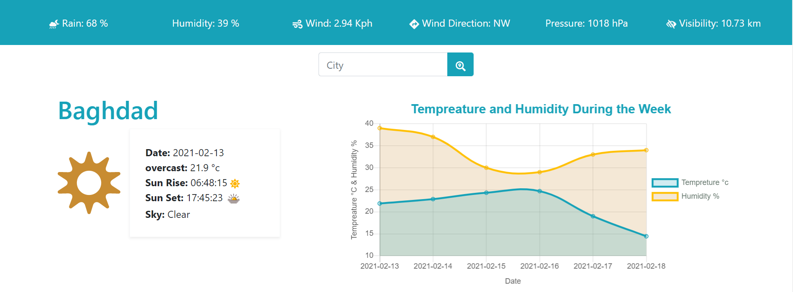
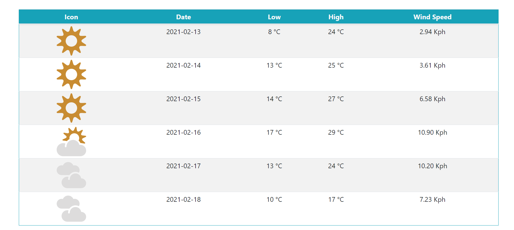

# Weather App
Weather App is a web based Application which is there show weather data based on the location that the user wants, and the data is loaded from  [Metaweather](https://www.metaweather.com/api/)  Api. 

it has a very simple and elegant interface as shown below: 
 

## Main Components of section 1:
1- Header: the header component is there to show (Rain predictability, Humidity ratio, Wind speed, Wind Direction, Pressure, Visibility) of the current day of the location that the user specifies. 

2- Search: the sarch component waits for the user to type the location they want to know the weather data about, and then it does a fetching requiest based on the user data to the API and returns the data. 

3- City Tempreature: after reciving the data from the API, this component shows data of the current day to the user. 

4- chart: the chart component uses a ling graph to show teampreatur differences within each day of the week starting from current date along side humidity of each day. 

## Section 2
 

in this section we have one table which is showing teampreatur data of the week as shown in the image. 

**React-Bootstrap** is used to deal with the design aspect of the project. 
**react-chartjs-2** is used for creating the chart. 

